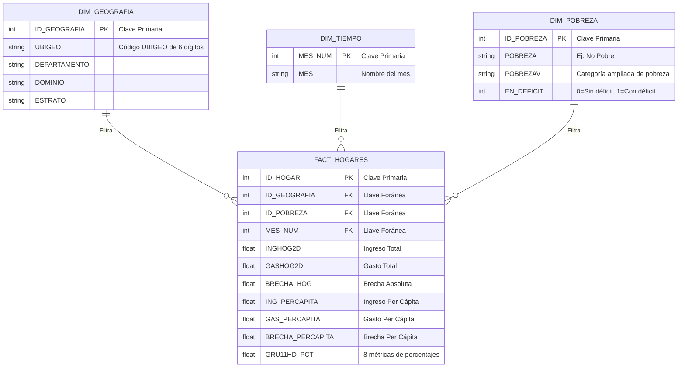

# Diagrama Entidad-Relación: Esquema Estrella ENAHO 2024

Este diagrama ilustra la arquitectura final del modelo de datos seleccionado para el proyecto.

```mermaid
erDiagram
    %% Definición de la Tabla de Hechos
    FACT_HOGARES {
        int ID_HOGAR PK "Clave Primaria"
        int ID_GEOGRAFIA FK "Llave Foránea"
        int ID_POBREZA FK "Llave Foránea"
        int MES_NUM FK "Llave Foránea"
        float INGHOG2D "Ingreso Total"
        float GASHOG2D "Gasto Total"
        float BRECHA_HOG "Brecha Absoluta"
        float ING_PERCAPITA "Ingreso Per Cápita"
        float GAS_PERCAPITA "Gasto Per Cápita"
        float BRECHA_PERCAPITA "Brecha Per Cápita"
        float GRU11HD_PCT "8 métricas de porcentajes"
    }

    %% Definición de las Dimensiones
    DIM_GEOGRAFIA {
        int ID_GEOGRAFIA PK "Clave Primaria"
        string UBIGEO "Código UBIGEO de 6 dígitos"
        string DEPARTAMENTO 
        string DOMINIO 
        string ESTRATO 
    }

    DIM_TIEMPO {
        int MES_NUM PK "Clave Primaria"
        string MES "Nombre del mes"
    }

    DIM_POBREZA {
        int ID_POBREZA PK "Clave Primaria"
        string POBREZA "Ej: No Pobre"
        string POBREZAV "Categoría ampliada de pobreza"
        int EN_DEFICIT "0=Sin déficit, 1=Con déficit"
    }

    %% Relaciones (1 a Muchos)
    DIM_GEOGRAFIA ||--o{ FACT_HOGARES : "Filtra"
    DIM_TIEMPO ||--o{ FACT_HOGARES : "Filtra"
    DIM_POBREZA ||--o{ FACT_HOGARES : "Filtra"
```
